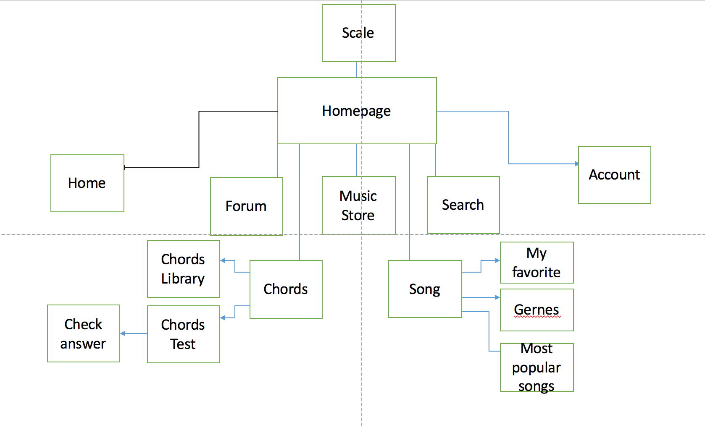
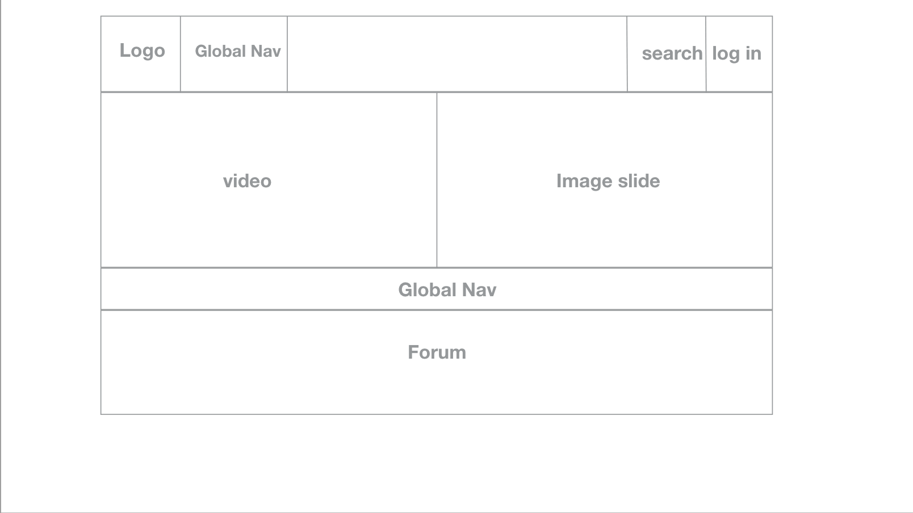
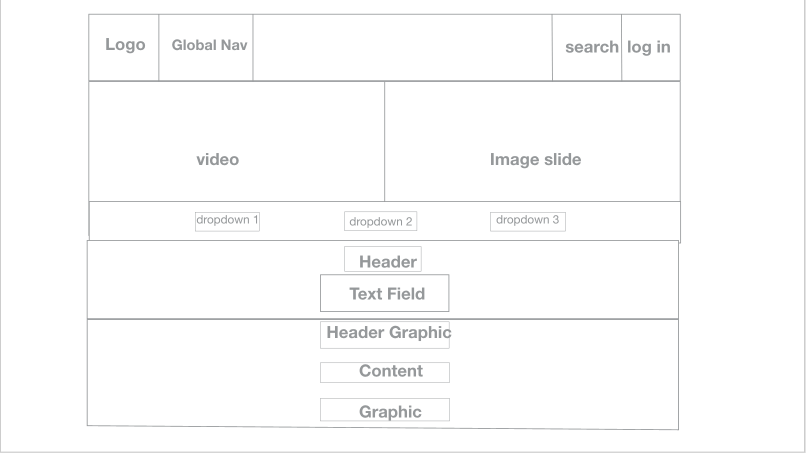
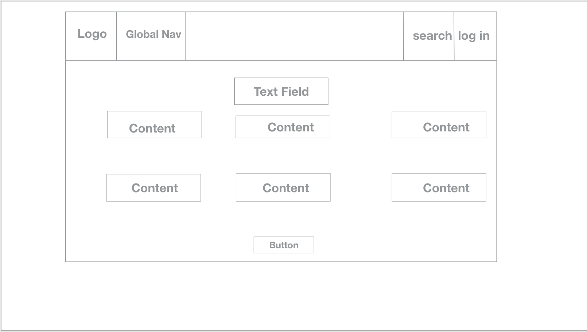

# MSTU 5003 Design Document (Template)

Write a design document where you explain your project. You should clearly explain the problem you're trying to solve. Be sure to describe the domain you're working with and the users you're trying to target. Remember that the point of your design document is that you can hand it off to any developer and theoretically they would be able to understand and build the program.

You'll be adding to your design document as you work towards your midterm due on **March 22, 2017**.

## Topic
This website is going to create an interactive and responsive environment for users to learn Ukulele.

## Problem
Firstly, I want to make learning ukulele an interesting experience. It is no longer a one-way learning process; instead, the learner could interact with the site. The site will respond to learner’s choice and give specific guidance, not through cliché and dull text-version answer, but through vivid pictures that simulates real ukulele playing experience. For example, our learner can select the tuning, root note, chords or scales. Once you finished your choice, there will be corresponding fingering position on the ukulele fretboard. This really provides learners an immersive and real learning process.
Secondly, this site aims to make learning ukulele an easy and relaxing process. So, instead of providing the learner a huge bunches of text-version books, this site has the most accessible, valuable resources stored for learners. The comprehensive but most commonly-used resources are provided both in language and images. Therefore, our learners are not easily to be confused and frustrated.
Thirdly, the site is a large song archive which is constantly being updated with new songs. Available videos and notes are provided. Besides, tips, guides will also be updated by the website as well as from other learners. Learners can also store their favorite songs after logging into their account.
Fourthly, this site aims to create a harmonious learning community. It is like a music club where ukulele learners are gathered together, sharing their interests, learning resources, questioning and looking for answers, and so on. This interaction will deepen mutual trust and positive feedback which brings satisfactory result.

## Target Audience
My target audience is teenagers aging from 12-18, who want to learn ukulele by themselves. These groups of people grow up in the age of media, so they are interested in new media, technology and social platform. They are busy in school days, so they want to use spare time relax themselves and develop an instrumental skill. But they don’t want to frustrate themselves to learn something hard, so they choose ukulele which is easier, more portable than guitar. Compared with one-to-one or off-line instructor, teenagers are more willing to learn an instrument through online videos, so that they can arrange their time flexibly. But it is also possible that when they are stuck, no one else around for help. They may also be afraid that it takes them time to find the most available resources, tips and guidance. They are also a group of people who are the followers of the most popular stuff, so they are always looking for something new and updated. In addition, they are a group of people who are looking for a sense of belonging, so a learning community will be attractive for them. They will be easily attracted by vivid, responsive, convenient, interesting and effective stuff. So, I think my website will be the one they are looking for.

### User Stories
**Outline 2-3 user stories. Describe how they find out, engage and come back to your site. Provide rationale.**

1.	My name is Mary. I’m 12 years old. I have learned piano since I was 6 years old. I’m interested in music so I want to try something more. I think guitar is pretty cool, but it is heavy and not easy to carry on anywhere, so I decide to try ukulele first which is easier and portable for me. I don’t want to go to a one-to-one class, because it is expensive. So, I think I can just search for online guide and some notes to practice, and then I can master it well. However, after my first trial of playing, I found ukulele is different from piano, because they have different notes, scales and chords. So, I think it is really necessary to learn it systematically. I have bought some books before, but I’m easy to get stuck, and the guides in the book do not correspond to the video on YouTube. So it is hard for me to make progress.
2.	My name is Andrew. I’m 18 years old. I’m a great lover of social media and computer. I just graduated from senior high school. During this summer, I want to learn a music instrument. But I have no idea about instrument before, so I wanna start from an easy one. I choose ukulele. I’m not sure I can master it or not, but I want to have a try, because at least ukulele is not costly. But I don’t want to spend money in tutoring, so online teaching is a good idea for me. I’m afraid I will easily give up if no one else around to motivate me, so I want to find a group of music lovers that can help each other. For me, mastering a new instrument is not the end of this summer. What I want is having fun and making friends. Just enjoy this process.
3.	My name is Alice. I’m 14 years old. Since I knew ukulele, I thought it was made for me. It is so cute, pretty, and portable. It satisfied all my fantasy of fairy tale. I really want to learn ukulele well and play beautiful and cute songs for my families and friends. So I determined to learn it well. If I can practice my favorite songs anytime and anywhere I want, that would be perfect!

## Strategy

This section should describe objectives, goals and metrics.

### Site Objectives:
*I want to make the site user friendly for the users to easily achieve their objectives; I want to improve the visual design and content structure so that users will enjoy their online experience; I want to make it easy, usable platform to convey the most important information; I want to make it easy for users to navigate to every section of the site; I want to add multimedia elements and make the learning experience interesting and effective; I want to improve user satisfaction through better service.

### Success Metrics
*Outline how you will check that the goals for your site have been met*
1. The number of unique people that visited my site per week(This will tell how many different people visit the site during a specific timeframe).  2. The number of people who registered a personal account in my site(This number will tell if users user the site for real learning or just for a visit). 3. The number of repeat visitors(If this number is growing, this means that people are visiting my site once and then deciding to come back again).4.where did these people come from (This information will tell you how to forge a relationship for advertising).5. View the top page report(It will tell me what pages my visitors think are the most important on my site).6. The keywords that people type in a search engine(This will tell what people are really looking for). 7.Measure assessment and comments.

Make sure your program does something to measure the consider assessments as a part of your program. Here are a couple.

* Pre assessments
* Formative assessments

## Scope
I'm creating a music instrument learning site. Compared with other learning ways, I want to add multimedia elements in to this online learning. The most important thing is to provide the users the core information and resources that they need to master an instrument. I want to complete my site before April 5th, and with maximum 1000$ budget. My target users will be a group of teenagers, aging from 12 to 18. Because my site is about ukulele, I will provide the most basic knowledge of ukulele, such as the chords, scales and notes. The most popular ukulele songs will also be listed for free use. I want to make the learners a supportive community, so forum will be established for discussion and comment. The user can register their user account and store the information that meets their need. My site will impress people with its features of vividness, brightness,informativeness and conciseness.  
There will be at least 5 pages in total. On the home page, there should be clear navigation bar, sign up area, a video  and a forum. I want images change in different pages, but the basic structure can pertain on all pages. Social media is a big market plan, so I want to include multimedia in my site. If it's something used often, provide links to all items you'd like to link to and they will be placed at the top if used a lot or bottom if not needing to be in main line of vision.
## Structure
Interaction design and information architecture

## Skeleton
Interface, navigation, information design

